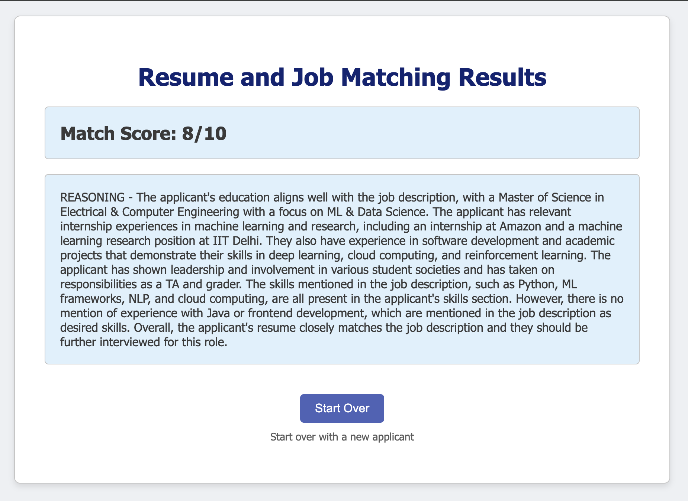

# Resume_JD_Screening
 
This is a simple full-stack project with python backend and html frontend. A hiring person can simply upload 2 pdf files -  applicant's resume and a job profile, and this tool will print a score between 0-10 based on how closely the candidate's experiences and educational background align with the requirements of the role.

Please access the app and test using your own Job Description and Resume at the following link deployed to AWS-
http://100.27.193.203:5001/

## Methodology
Wrote python program to extract text from pdf.
Fed job description to gpt 3.5 and shortened it to stick to 16 input token limit.
Engineered a prompt and fed text from resume and job description.
Using regular expression to extract score and comments from gpt.
Formatted and printed them on a separate page.
Converted to Flask API, REST api.
Wrote Dockerfile to convert and test Docker image .
After verificaiton, created EC2 instance on AWS and pulled the code from Github.
Created docker image from Dockerfile and executed it, saving all logs, making sure auto-restart is on with Gunicorn so if anything happens, the code will keep running.

## Future Works/Features
Can send more prompts to GPT from an applicant's perspective for example - "Please list keywords i should add to my Resume to increase resume match score".
Can add a textbox for inputting job description instead of uploading pdfs so that user can simply CTRL+A, CTRL+C, and CTRL+V.
Could add one more input such as a Cover Letter(optional).
Instead of sending text prompts only, I can upload these 2 pdf files to Azure Blob storage, run a predefined indexer to update the indices of an Azure Search Service, and then ask questions using those indices as Knowledge base. This solution is more extensive, costs more due to the multiple various services, however provides us more streamlined control over authentication and privacy, happy to discuss more about this solution since I have prior experience with this solution.
GPT4 provides more consistent answers that always stick to word limits, but due to lack of available credits in my Azure zone, I could only access gpt 3.5 turbo 16K hence the outputs can be improved a lot simply by accessing GPT4.

Upload your Resume and Job Description

View results, and then you can be redirected back to the original upload page.